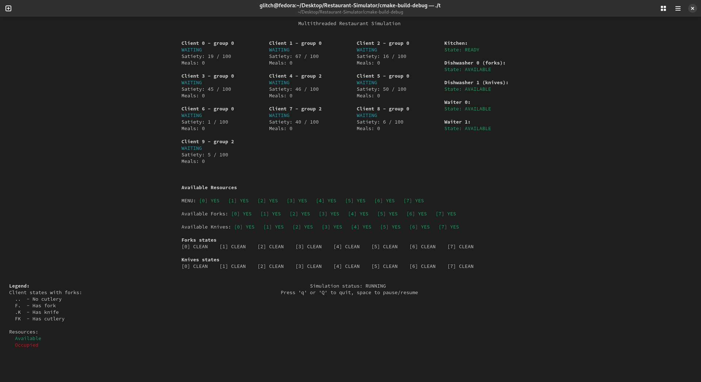
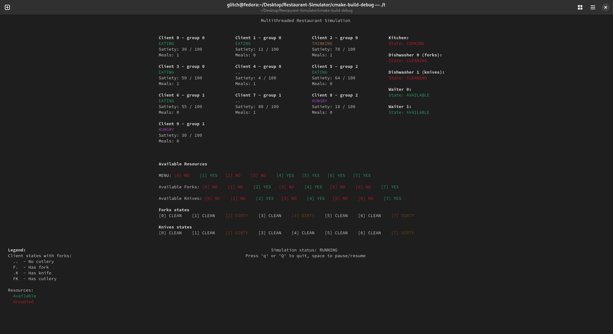
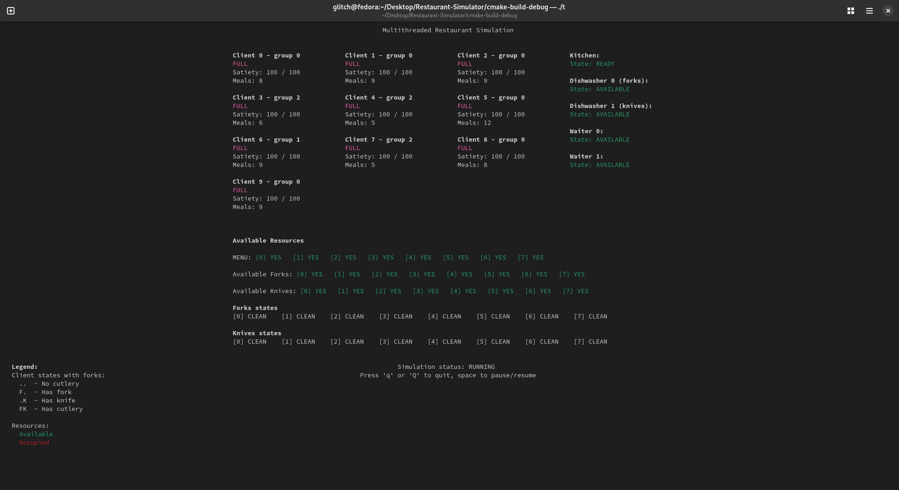

# Restaurant-Simulator
**Restaurant-Simulator** is a multithreaded `C/C++` application that simulates the operation of a restaurant using `POSIX` threads, mutexes, condition variables, and `ncurses` for a real-time terminal interface.

## Features
### 🧍‍♂️ Clients and Groups
- Each client is represented as a separate thread.
- Clients can arrive alone (single person group) or as part of a mininum two person group.
- Members of a group must sit at the same table.
- After being seated, clients request a menu, choose a dish, and wait to be served.

### 🪑 Table and Seating Management
- Tables have limited capacity; large groups wait for a free table big enough for all members.
- Once a group is seated, the table is locked for their exclusive use.
- The seating logic ensures no overbooking or conflict between client groups.

### 🧑‍🍳 Waiter Behavior
- Waiters are active threads that handle:
    - Seating clients
    - Delivering menus
    - Collecting orders
    - Bringing prepared dishes from the kitchen to tables
- Waiters communicate with kitchen.

### 🍝 Kitchen and Meal Preparation
- The kitchen has a shared queue for pending meal requests.
- When a dish is ready, it’s placed in a `ready_queue`.
- Waiters collect dishes from this queue and deliver them to the right clients.

### 🍴 Resource Synchronization (resources, Menus)
- Limited resources (e.g. forks, knives, dish) must be available for clients to start eating.
- resources are assigned to specific tables and cleaned after use.
- Menus are limited and must be returned before reuse.

### 🧼 Dishwasher Logic
- A dishwasher thread handles the washing of dirty cutlery.
- Clean cutlery are returned for reuse.
- Synchronization ensures the dishwasher does not conflict with waiter or client actions.

### 📟 Ncurses Terminal Interface
- Real-time visualization of the restaurant state in the terminal.
- Color-coded states, clients, waiters, and resources.
- Live status updates of threads states (e.g. waiting, eating, finished).

### 🔄 Thread Synchronization and Safety
- Uses `pthread_mutex_t` and `pthread_cond_t` for controlling access to shared resources.
- Prevents deadlocks, starvation, and race conditions.
- Logically separates states of each entity (client, waiter, dish, etc.).

### Prerequisites
Make sure the following are installed:
- `GCC` or `Clang`
- `make`
- `cmake`
- POSIX-compliant OS (`Linux`)
- `libncurses5`

#### On Fedora:
```
sudo dnf install gcc make cmake ncurses-devel
```
## Build & Run

### 🔧 Build
```
git clone https://github.com/wgrzyb271/Restaurant-Simulator.git
cd Restaurant-Simulator
mkdir build
cd build
cmake ..
make
```
### 🚀 Run
```
./restaurant_simulator
```

## Example Screenshots
**Simulation Start**



**Simulation in Progress**



**Simulation End**

